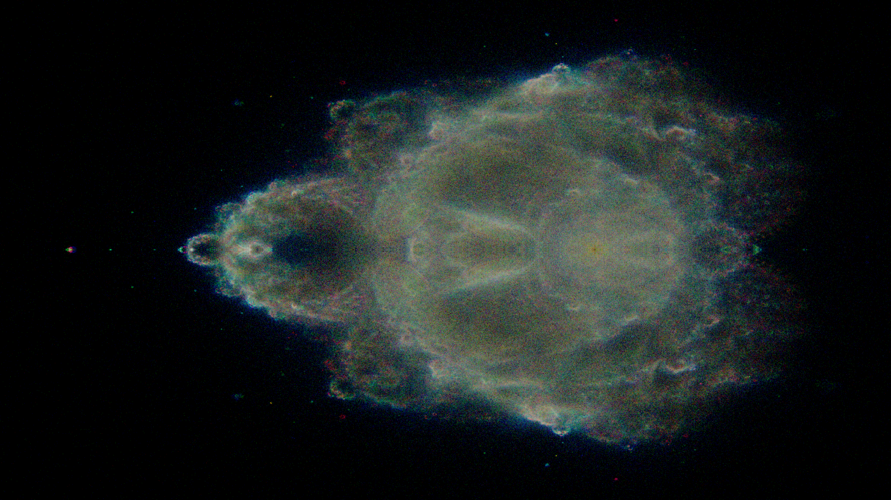

# BuddhabrotPY
Buddhabrot Fractal Renderer (Numba Accelerated)
# Buddhabrot Fractal Renderer (Numba Accelerated)

High-resolution **Buddhabrot fractal renderer** written in Python and accelerated using **Numba** for parallel CPU execution.  
This implementation focuses on **physical symmetry**, **high sample counts**, and **clean color separation** without artificial glow effects.

---

## 🌀 What is Buddhabrot?

Unlike the classic Mandelbrot set, **Buddhabrot** visualizes the *orbits of escaping points* rather than the points that remain bounded.

Each pixel represents how often an orbit passes through that region of the complex plane, producing ghostly, nebula-like structures with remarkable depth.

This implementation:
- Tracks full orbits of escaping trajectories
- Accumulates orbit density into RGB channels
- Uses escape-time ranges for natural color separation

---

## ✨ Features

- 🚀 **Numba JIT acceleration** with parallel execution
- 🧮 High iteration depth (`max_iter = 2000`)
- 🎯 Millions of random samples (`2,000,000+`)
- 🎨 RGB channel separation based on escape iteration
- 🪞 Vertical symmetry optimization
- ❌ No artificial glow, blur, or post-processing tricks
- 🖼️ Native **1920×1080** Full HD output

---

## 📸 Example Output

